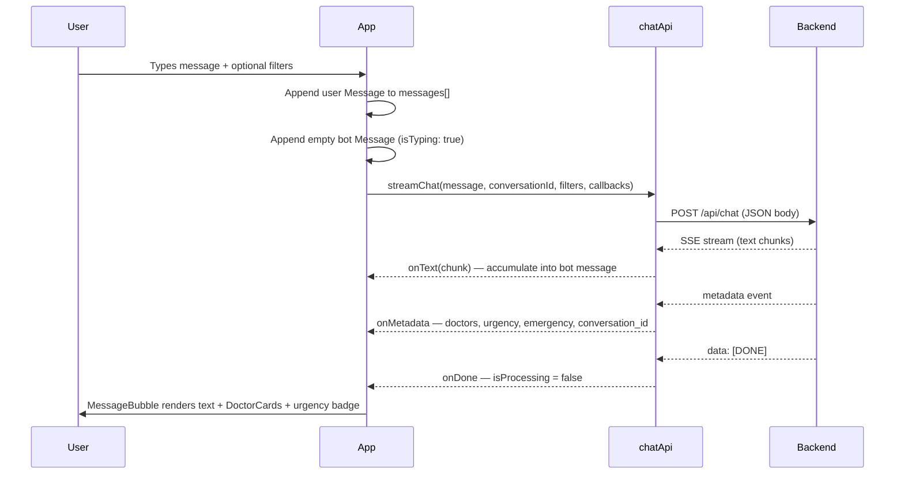

# Dr.Doctor Frontend — Architecture

> **Audience:** Backend LLMs and engineers who need a system-level view of the React frontend — what it does, how data flows, and what it expects from the API.

For per-file implementation detail (components, services, types), see [FRONTEND_MODULES.md](./FRONTEND_MODULES.md).

---

## 1. Purpose

The frontend is a **single-page medical chat assistant** (`dr.doctor`). Users describe symptoms in natural language; the UI streams AI responses from `POST /api/chat`, renders markdown text progressively, and displays structured doctor recommendations when the backend sends them in a `metadata` SSE event.

There is **no client-side routing**, **no global state library**, and **no authentication**. All application state lives in `App.tsx` via React `useState`.

---

## 2. Tech Stack

| Layer | Choice | Notes |
|-------|--------|-------|
| Framework | React 19 | Functional components + hooks |
| Build tool | Vite 6 | Dev server on port **3000** |
| Language | TypeScript 5.8 | Strict typing in `types.ts` |
| Styling | Tailwind CSS (CDN) | Configured inline in `index.html`; dark mode via `class` on `<html>` |
| Icons | lucide-react | Used across App and components |
| Markdown | react-markdown | Bot message text rendering |
| API | Native `fetch` + ReadableStream | SSE parsing in `services/chatApi.ts` |

---

## 3. Directory Structure

```
frontend/
├── index.html          # HTML shell, Tailwind config, global CSS
├── index.tsx           # React mount + service worker registration
├── App.tsx             # Root component — all app state and orchestration
├── types.ts            # Shared TypeScript interfaces and enums
├── vite.config.ts      # Vite dev server (port 3000, @ alias)
├── manifest.json       # PWA manifest
├── sw.js               # Service worker (production cache)
├── services/
│   └── chatApi.ts      # Backend SSE client — sole API integration point
└── components/
    ├── MessageBubble.tsx   # Chat message renderer (user/bot/system)
    ├── DoctorCard.tsx      # Doctor recommendation card
    └── HospitalCard.tsx    # Legacy map/place card (backward compat)
```

---

## 4. Component Tree

```
index.tsx
└── App.tsx
    ├── Background blurs (decorative)
    ├── Mobile drawer sidebar
    ├── Desktop sidebar
    └── main (chat area)
        ├── Mobile header
        ├── Message list
        │   └── MessageBubble × N
        │       ├── DoctorCard × N   (from metadata.doctors_shown)
        │       └── HospitalCard × N (legacy, inactive)
        └── Input area (filter chips + textarea + send)
```

---

## 5. High-Level Data Flow



---

## 6. Application State

All state is local to `App.tsx`. No Redux, Zustand, or React Context.

| State | Type | Purpose |
|-------|------|---------|
| `messages` | `Message[]` | Full chat history including hardcoded welcome message |
| `inputValue` | `string` | Textarea content |
| `isProcessing` | `boolean` | True while SSE stream is active; disables send |
| `location` | `Coordinates \| null` | User GPS from browser geolocation |
| `locationStatus` | `'idle' \| 'requesting' \| 'granted' \| 'denied'` | Geolocation lifecycle |
| `activeFilters` | `FilterType[]` | `'price'`, `'nearest'`, `'experienced'` |
| `isDarkMode` | `boolean` | Theme; synced to `localStorage` + `<html class="dark">` |
| `isSidebarOpen` | `boolean` | Mobile drawer visibility |
| `conversationId` | `string \| null` | Persisted across turns from backend `metadata` |

---

## 7. Backend Contract

### Single integration point

`services/chatApi.ts` → `POST http://localhost:8000/api/chat`

### Request body

```jsonc
{
  "message": "user's trimmed input text",
  "conversation_id": "uuid",   // omitted on first message; included on follow-ups
  "filters": {
    "user_lat": 24.8607,         // only when "Nearest" filter ON + geolocation granted
    "user_lng": 67.0011,
    "max_fee": 1500,             // only when "Best Price" filter ON
    "min_satisfaction": 80       // only when "Top Rated" filter ON
  }
}
```

### Filter toggle → backend mapping

| UI label | Filter id | Backend field | Value when active |
|----------|-----------|---------------|-------------------|
| Best Price | `price` | `filters.max_fee` | `1500` (PKR, hardcoded) |
| Nearest | `nearest` | `filters.user_lat`, `filters.user_lng` | From `navigator.geolocation` |
| Top Rated | `experienced` | `filters.min_satisfaction` | `80` (hardcoded) |

Filters are **additive**. Empty `filters: {}` when none selected. If Nearest is on but geolocation was denied, coordinates are **not sent**.

### SSE response

Lines starting with `data: `, three JSON event types:

1. **`text`** — `{ type: "text", content: string }` — appended to bot bubble
2. **`metadata`** — structured payload (doctors, urgency, conversation_id)
3. **`error`** — `{ type: "error", code: number, message: string }` — shown as bot message text

Stream ends with `data: [DONE]`.

Expected order: text events → metadata → `[DONE]`.

---

## 8. Backend Data → UI Mapping

| Backend field | Frontend destination | Rendered by |
|---------------|---------------------|-------------|
| `conversation_id` | `App.conversationId` | — |
| Text chunks (`text` events) | `Message.text` | MessageBubble (ReactMarkdown) |
| `doctors_shown[]` | `Message.doctors` | DoctorCard (horizontal scroll) |
| `urgency` | `Message.urgency` | MessageBubble urgency badge |
| `emergency` | `Message.emergency` | MessageBubble emergency banner |
| `symptoms_extracted` | **Not displayed** | — |
| `specialties_targeted` | **Not displayed** | — |
| `safe_to_proceed` | **Not used** | — |
| `user_facing_note` | **Not used separately** | Text is in `text` stream |

When `emergency === true`, doctor cards are **not rendered** even if `doctors_shown` is populated.

---

## 9. UI Layout

```
┌─────────────────────────────────────────────────────────────┐
│  Desktop: Sidebar (w-80)  │  Main Chat Area (flex-1)        │
│  - Logo + theme toggle    │  - Message list (scroll)       │
│  - HIPAA badge            │  - Filter chips                │
│  - History (placeholder)  │  - Input textarea + send       │
│                           │                                │
│  Mobile: Drawer sidebar   │  - Mobile header (menu, theme,  │
│  (overlay)                │    location)                   │
└─────────────────────────────────────────────────────────────┘
```

- **Breakpoint:** `md:` (768px) — sidebar becomes slide-over drawer on mobile
- **Initial message:** Hardcoded welcome bot message in `App.tsx`
- **Conversation history:** Placeholder only — not wired to backend

---

## 10. Cross-Cutting Concerns

### Geolocation

Auto-requested on mount via `navigator.geolocation.getCurrentPosition()`. Coordinates only sent when **Nearest** filter is active. Mobile header has a MapPin button to re-request.

### Theme

Default dark mode. Persisted in `localStorage` key `theme`. Logo swaps: `/assets/logo.png` (dark) vs `/assets/black_logo.png` (light).

### PWA

`manifest.json` + `sw.js` registered in production only. Caches shell assets; **API calls never cached**.

---

## 11. Endpoints NOT Used

- `GET /api/doctors/search`
- `GET /health`

---

## 12. Key Constraints for Backend Developers

1. **Streaming required** — UI expects progressive `text` events, not a single JSON blob
2. **`metadata` before `[DONE]`** — doctor cards and urgency attach on metadata
3. **Nullable fields** — `fee_*`, `satisfaction_pct`, `reviews_count`, `distance_km` can be `null`
4. **`conversation_id` must be stable** across multi-turn conversations
5. **Emergency flow** — `emergency: true`, `urgency: "emergency"`, empty `doctors_shown`; frontend shows red banner with `tel:115`
6. **CORS** — frontend `localhost:3000`, backend `localhost:8000`; no dev proxy

---

## 13. Related Documents

- [FRONTEND_MODULES.md](./FRONTEND_MODULES.md) — Detailed behavior of every file (components, services, types, bootstrap)
- [FRONTEND_INTEGRATION.md](./FRONTEND_INTEGRATION.md) — Backend API reference (request/response schemas, SSE format, error codes)
